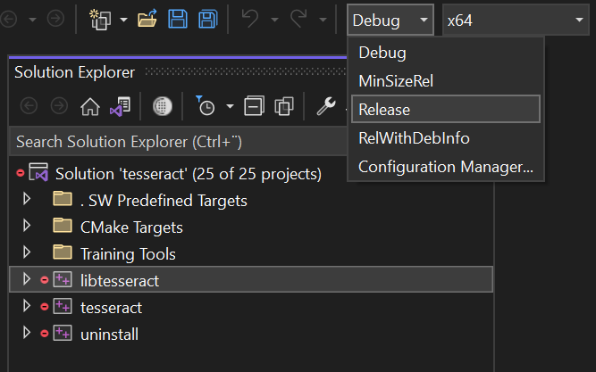

# Building [Tesseract ocr](https://github.com/tesseract-ocr) for 64 bit Windows devices

26.3.2023

Using x86_64 Visual studio 2022 with Windows 11 as build platform

## Step 1: Install build tools

### Install cmake and git using winget in your terminal

```powershell
winget install cmake
winget install Git.Git
```

### Download Software Network

1. Download "sw-master-windows_x86_64-client.zip" from [Software Network website](https://software-network.org/client/)
2. Unzip the downloaded file
3. Set path variable  
   a) Replace `[Path/to/folder/containing_sw.exe]` with your path  
   b) Do not include `sw.exe` in path  
   c) Use full path with drive letter

```powershell
SET PATH=%PATH%;[Path/to/folder/containing_sw.exe];
```

### Install [visual studio 2022](https://visualstudio.microsoft.com/vs/) with c++ tools

Select c++ tools when asked

## Step 2 Clone tesseract Github repository

### Clone tesseract with git command to folder of your choise

```powershell
git clone https://github.com/tesseract-ocr/tesseract
```

### Go inside cloned folder

```powershell
cd tesseract
```

## Step 3 Run cmake

### Create new `build` folder and go inside it

```powershell
mkdir build && cd build
```

### Run cmake

```
cmake ..
```

## Build solution

### you should now have folder structure with these files (and also many others)

```
> tesseract
    > build
        > tesseract.sln
```



### Open tesseract.sln with visual studio

1. Set build mode to Release
2. Click libtesseract > properties
3. Click `libtesseract` and `Build`
4. Wait until the build is completed

You should now find the tesseract library inside folder

```
> tesseract
    > build
        > Release
            > tesseract53.lib
```
